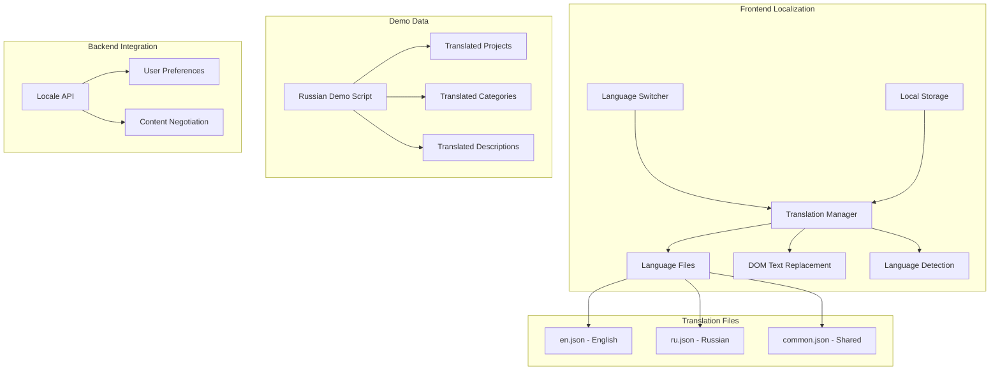
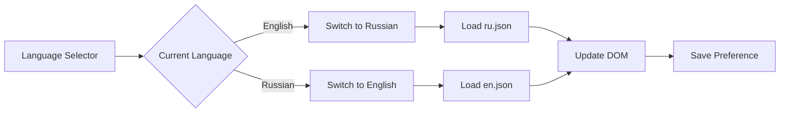
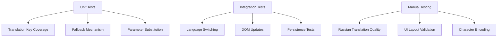

# Localization Setup Design

## Overview

This design outlines the implementation of internationalization (i18n) support for the community-fundchain platform with Russian language translation. The system currently uses vanilla JavaScript and HTML with hardcoded English text content. The solution will implement a lightweight localization framework that supports dynamic language switching and provides Russian translations for all user-facing content.

## Technology Stack & Dependencies

### Frontend Localization
- **Vanilla JavaScript** - Custom i18n implementation without external frameworks
- **JSON Translation Files** - Language-specific translation dictionaries
- **localStorage** - User language preference persistence
- **CSS** - RTL support preparation (future enhancement)

### Backend Localization  
- **Python** - Demo data localization scripts
- **JSON/YAML** - Translatable content configuration files
- **FastAPI** - API endpoint for language preferences (future enhancement)

## Component Architecture

### Translation System Structure



### Frontend Translation Manager

#### Core Translation Class
```javascript
class TranslationManager {
  constructor() {
    this.currentLanguage = 'en';
    this.translations = {};
    this.fallbackLanguage = 'en';
  }
  
  // Load translation files
  async loadLanguage(language) { }
  
  // Get translated text with fallback
  t(key, params = {}) { }
  
  // Apply translations to DOM
  applyTranslations() { }
  
  // Switch language
  setLanguage(language) { }
}
```

#### Translation Key Structure
```json
{
  "navigation": {
    "dashboard": "Dashboard",
    "projects": "Projects", 
    "voting": "Voting",
    "treasury": "Treasury",
    "personal": "My Stats",
    "admin": "Admin"
  },
  "dashboard": {
    "title": "Community Fund Dashboard",
    "treasury_balance": "Treasury Balance (ETH)",
    "donations_7d": "Donations (7 days)",
    "active_projects": "Active Projects",
    "soft_cap_reached": "Soft-cap Reached"
  },
  "projects": {
    "title": "Projects",
    "create_project": "Create Project",
    "category_filter": "Category",
    "status_filter": "Status",
    "all_categories": "All Categories",
    "all_status": "All Status"
  }
}
```

### Language Switcher Component



#### Implementation Details
- **Position**: Top-right header area next to status indicators
- **Visual**: Flag icons or text-based selector
- **Persistence**: localStorage to remember user preference
- **Animation**: Smooth transition during language switch

### Translation File Organization

#### File Structure
```
web/
├── locales/
│   ├── en.json          # English translations
│   ├── ru.json          # Russian translations
│   └── common.json      # Shared translations
├── js/
│   └── i18n.js          # Translation manager
└── index.html           # Updated with data-i18n attributes
```

#### English Translation File (en.json)
```json
{
  "app": {
    "title": "FundChain — Traceable Community Fund (MVP)",
    "logo": "🏛️ FundChain"
  },
  "navigation": {
    "dashboard": "Dashboard",
    "projects": "Projects",
    "voting": "Voting", 
    "treasury": "Treasury",
    "personal": "My Stats",
    "admin": "Admin"
  },
  "status": {
    "last_updated": "Last updated",
    "k_anonymous": "k≥5 anonymous",
    "privacy_protected": "Privacy protected"
  },
  "dashboard": {
    "title": "Community Fund Dashboard",
    "treasury_balance": "Treasury Balance (ETH)",
    "donations_7d": "Donations (7 days)",
    "active_projects": "Active Projects", 
    "soft_cap_reached": "Soft-cap Reached",
    "funding_queue": "Funding Queue"
  },
  "filters": {
    "all_categories": "All Categories",
    "all_status": "All Status",
    "infrastructure": "Infrastructure",
    "healthcare": "Healthcare", 
    "education": "Education",
    "emergency_aid": "Emergency Aid",
    "environment": "Environment",
    "social": "Social",
    "culture": "Culture"
  },
  "table": {
    "project": "Project",
    "priority_weight": "Priority/Weight",
    "progress": "Progress", 
    "needed": "Needed",
    "voting_results": "Voting Results",
    "eta": "ETA",
    "actions": "Actions",
    "loading": "Loading projects..."
  },
  "projects": {
    "create_project": "Create Project",
    "category": "Category",
    "status": "Status",
    "active": "Active",
    "voting": "Voting",
    "ready_to_payout": "Ready to Payout",
    "funded": "Funded",
    "pending": "Pending"
  },
  "voting": {
    "title": "Priority Voting",
    "round_complete": "Voting Round Complete",
    "projects_in_round": "Projects in Current Round",
    "voting_results": "Voting Results",
    "start_new_round": "Start New Round"
  },
  "treasury": {
    "title": "Treasury Overview",
    "total_balance": "Total Balance",
    "total_donations": "Total Donations",
    "total_allocated": "Total Allocated", 
    "total_paid_out": "Total Paid Out",
    "export_csv": "Export CSV"
  },
  "personal": {
    "title": "Personal Statistics",
    "load_stats": "Load Stats",
    "total_donated": "Total Donated (ETH)",
    "projects_supported": "Projects Supported"
  },
  "buttons": {
    "create": "Create",
    "submit": "Submit", 
    "cancel": "Cancel",
    "save": "Save",
    "delete": "Delete",
    "edit": "Edit",
    "view": "View",
    "export": "Export",
    "refresh": "Refresh"
  },
  "messages": {
    "loading": "Loading...",
    "no_data": "No data available",
    "error": "An error occurred",
    "success": "Operation completed successfully"
  }
}
```

#### Russian Translation File (ru.json)
```json
{
  "app": {
    "title": "FundChain — Отслеживаемый Общественный Фонд (MVP)",
    "logo": "🏛️ FundChain"
  },
  "navigation": {
    "dashboard": "Панель управления",
    "projects": "Проекты", 
    "voting": "Голосование",
    "treasury": "Казначейство",
    "personal": "Моя статистика",
    "admin": "Администрирование"
  },
  "status": {
    "last_updated": "Последнее обновление",
    "k_anonymous": "k≥5 анонимно",
    "privacy_protected": "Конфиденциальность защищена"
  },
  "dashboard": {
    "title": "Панель управления общественным фондом",
    "treasury_balance": "Баланс казначейства (ETH)",
    "donations_7d": "Пожертвования (7 дней)",
    "active_projects": "Активные проекты",
    "soft_cap_reached": "Достигнут мягкий лимит",
    "funding_queue": "Очередь финансирования"
  },
  "filters": {
    "all_categories": "Все категории",
    "all_status": "Все статусы",
    "infrastructure": "Инфраструктура",
    "healthcare": "Здравоохранение",
    "education": "Образование", 
    "emergency_aid": "Экстренная помощь",
    "environment": "Экология",
    "social": "Социальные",
    "culture": "Культура"
  },
  "table": {
    "project": "Проект",
    "priority_weight": "Приоритет/Вес",
    "progress": "Прогресс",
    "needed": "Требуется",
    "voting_results": "Результаты голосования", 
    "eta": "Ожидаемое время",
    "actions": "Действия",
    "loading": "Загрузка проектов..."
  },
  "projects": {
    "create_project": "Создать проект",
    "category": "Категория",
    "status": "Статус",
    "active": "Активный",
    "voting": "Голосование",
    "ready_to_payout": "Готов к выплате",
    "funded": "Профинансирован",
    "pending": "В ожидании"
  },
  "voting": {
    "title": "Приоритетное голосование",
    "round_complete": "Раунд голосования завершен",
    "projects_in_round": "Проекты в текущем раунде",
    "voting_results": "Результаты голосования",
    "start_new_round": "Начать новый раунд"
  },
  "treasury": {
    "title": "Обзор казначейства",
    "total_balance": "Общий баланс",
    "total_donations": "Всего пожертвований",
    "total_allocated": "Всего распределено",
    "total_paid_out": "Всего выплачено",
    "export_csv": "Экспорт CSV"
  },
  "personal": {
    "title": "Личная статистика",
    "load_stats": "Загрузить статистику",
    "total_donated": "Всего пожертвовано (ETH)",
    "projects_supported": "Поддержанные проекты"
  },
  "buttons": {
    "create": "Создать",
    "submit": "Отправить",
    "cancel": "Отмена", 
    "save": "Сохранить",
    "delete": "Удалить",
    "edit": "Редактировать",
    "view": "Просмотр",
    "export": "Экспорт",
    "refresh": "Обновить"
  },
  "messages": {
    "loading": "Загрузка...",
    "no_data": "Данные отсутствуют",
    "error": "Произошла ошибка", 
    "success": "Операция выполнена успешно"
  }
}
```

## Russian Demo Data Script

### Script Structure
```
scripts/
├── seed_demo_ru.py          # Russian demo data seeding
├── demo_data_ru.json        # Russian translation data
└── localization_utils.py    # Translation utilities
```

### Russian Project Templates
```python
russian_project_templates = [
    {
        "name": "Общественная поликлиника",
        "description": "Современное медицинское учреждение для обслуживания местного сообщества с современным оборудованием и опытным медицинским персоналом. Поликлиника будет предоставлять первичную медицинскую помощь, профилактические услуги и неотложную помощь.",
        "category": "healthcare",
        "target": Decimal("50.0"),
        "soft_cap": Decimal("30.0"),
        "hard_cap": Decimal("75.0"),
        "priority": 1
    },
    {
        "name": "Центр цифрового обучения",
        "description": "Комплексное образовательное учреждение, оснащенное современными компьютерами, высокоскоростным интернетом и цифровыми обучающими платформами для преодоления цифрового неравенства в образовании.",
        "category": "education",
        "target": Decimal("35.0"),
        "soft_cap": Decimal("20.0"), 
        "hard_cap": Decimal("50.0"),
        "priority": 2
    },
    {
        "name": "Сеть возобновляемой энергии",
        "description": "Установка солнечных панелей и системы накопления энергии для обеспечения чистой, устойчивой энергии для сообщества, снижая углеродный след и затраты на энергию.",
        "category": "infrastructure", 
        "target": Decimal("80.0"),
        "soft_cap": Decimal("50.0"),
        "hard_cap": Decimal("120.0"),
        "priority": 3
    },
    {
        "name": "Приют для бездомных и служба поддержки",
        "description": "Комплексное приютское учреждение с социальными услугами, профессиональным обучением, поддержкой психического здоровья и программами реабилитации для помощи людям в переходе к постоянному жилью.",
        "category": "social",
        "target": Decimal("45.0"),
        "soft_cap": Decimal("25.0"),
        "hard_cap": Decimal("65.0"),
        "priority": 4
    },
    {
        "name": "Инициатива городского фермерства", 
        "description": "Вертикальная ферма с использованием гидропонных систем для обеспечения свежих, выращенных местно продуктов круглый год, создавая образовательные возможности и рабочие места.",
        "category": "environment",
        "target": Decimal("25.0"),
        "soft_cap": Decimal("15.0"),
        "hard_cap": Decimal("35.0"),
        "priority": 5
    },
    {
        "name": "Система экстренного реагирования",
        "description": "Современная сеть экстренной связи и реагирования, включая системы оповещения, аварийное оборудование и программы обучения для обеспечения безопасности сообщества.",
        "category": "infrastructure",
        "target": Decimal("60.0"), 
        "soft_cap": Decimal("40.0"),
        "hard_cap": Decimal("85.0"),
        "priority": 6
    },
    {
        "name": "Молодежный центр искусств и культуры",
        "description": "Творческое пространство для молодых людей для изучения искусства, музыки, театра и культурных мероприятий с профессиональным обучением и возможностями для выступлений.",
        "category": "culture",
        "target": Decimal("30.0"),
        "soft_cap": Decimal("18.0"),
        "hard_cap": Decimal("45.0"),
        "priority": 7
    },
    {
        "name": "Реновация учреждения для пожилых",
        "description": "Полная реновация существующего учреждения по уходу за пожилыми людьми для соответствия современным стандартам доступности и обеспечения повышенного комфорта и ухода для пожилых жителей.",
        "category": "healthcare",
        "target": Decimal("55.0"),
        "soft_cap": Decimal("35.0"),
        "hard_cap": Decimal("75.0"),
        "priority": 8
    }
]
```

### Translation Integration Script
```python
#!/usr/bin/env python3
"""
Russian Demo Data Seeding Script for FundChain
Создание демонстрационных данных на русском языке
"""

class RussianDemoDataSeeder(DemoDataSeeder):
    """Демонстрационные данные на русском языке для FundChain."""
    
    def __init__(self):
        super().__init__()
        self.load_russian_translations()
    
    def load_russian_translations(self):
        """Загрузка русских переводов."""
        self.translations = {
            "categories": {
                "healthcare": "здравоохранение",
                "education": "образование", 
                "infrastructure": "инфраструктура",
                "social": "социальные",
                "environment": "экология",
                "culture": "культура"
            },
            "status": {
                "active": "активный",
                "pending": "в ожидании",
                "funded": "профинансирован",
                "voting": "голосование",
                "ready_to_payout": "готов к выплате"
            }
        }
    
    async def create_sample_projects(self):
        """Создание образцов проектов на русском языке."""
        # Implementation with Russian project templates
        pass
    
    async def create_sample_members(self):
        """Создание участников сообщества с русскими именами."""
        # Implementation with Russian member names/descriptions
        pass
```

## Testing Strategy

### Translation Testing


#### Translation Coverage Tests
- Verify all UI text has translation keys
- Test fallback to English for missing translations
- Validate parameter interpolation in translations
- Check special characters and Cyrillic text rendering

#### Language Switch Testing  
- Test immediate DOM updates on language change
- Verify localStorage persistence across sessions
- Test language detection from browser settings
- Validate smooth transitions without layout breaks

### Demo Data Testing
- Verify Russian project names and descriptions
- Test category translations consistency
- Validate database encoding for Cyrillic characters
- Check API response formatting with Russian content

## Implementation Steps

### Phase 1: Translation Infrastructure
1. Create translation manager JavaScript class
2. Implement language file loading mechanism  
3. Add data-i18n attributes to HTML elements
4. Create English translation file (baseline)
5. Implement language switcher UI component

### Phase 2: Russian Translation
1. Create comprehensive Russian translation file
2. Professional translation review for technical terms
3. Cultural adaptation for donation/funding terminology
4. Test character encoding and display

### Phase 3: Demo Data Localization
1. Create Russian demo data script
2. Translate project names, descriptions, categories
3. Adapt cultural context for Russian community projects
4. Test database storage and retrieval

### Phase 4: Integration & Testing
1. Integrate translation system with existing frontend
2. Add language preference persistence
3. Comprehensive testing across all sections
4. Performance optimization for translation loading

## Cultural Considerations

### Russian Localization Specifics
- **Formal vs Informal**: Use formal address forms (Вы) for interface
- **Currency**: Display ETH with proper Russian number formatting
- **Date/Time**: Russian date format (DD.MM.YYYY)
- **Cultural Context**: Adapt community funding concepts to Russian social context

### Technical Considerations
- **Character Encoding**: UTF-8 support for Cyrillic text
- **Text Length**: Russian text typically 15-20% longer than English
- **Font Support**: Ensure web fonts support Cyrillic characters
- **Input Validation**: Support Cyrillic characters in forms

## Performance Considerations

### Translation Loading Strategy
- **Lazy Loading**: Load translations on demand
- **Caching**: Browser cache for translation files
- **Fallback**: Progressive enhancement with English as base
- **Bundle Size**: Minimize translation file sizes

### Optimization Techniques
- **JSON Compression**: Minified translation files
- **CDN Delivery**: Serve translation files from CDN
- **Browser Caching**: Long-term caching for translation files
- **Progressive Loading**: Load critical translations first